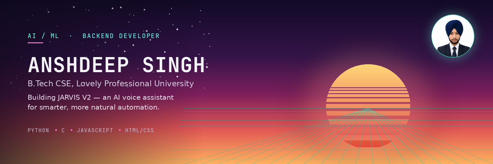

 

## About Me

I'm a B.Tech Computer Science student at **Lovely Professional University**, focused on **AI/ML**, **backend development**, and **intelligent systems**. I learn best by building — turning ideas into working software rather than only studying them in theory.

I enjoy solving real problems through code, and I'm always open to connecting with other developers, students, and professionals to learn, collaborate, and grow.

## Currently Building

**JARVIS V2** — the next version of my personal AI voice assistant, focused on automation and creating smarter, more natural user experiences. It's where I apply what I'm learning in AI and backend engineering to a real, evolving project.

## Tech Stack

## Featured Projects

| Project | Description | Stack |
|---|---|---|
| [**Jarvis**](https://github.com/ansh7988/Jarvis) | Personal AI voice assistant | Python |
| [**summer-demo**](https://github.com/ansh7988/summer-demo) | Summer project repository | HTML |
| [**Vyom-AI**](https://github.com/ansh7988/Vyom-AI) | AI-focused project | — |

## GitHub Stats

## Connect With Me

B.Tech CSE, Lovely Professional University · Exploring opportunities in AI/ML and backend development

